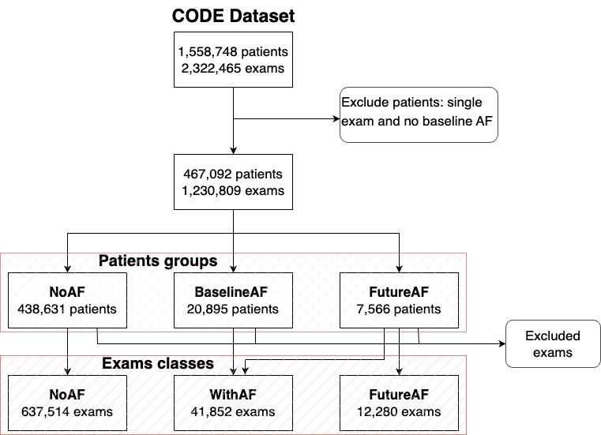

# Risk Prediction of Atrial Fibrillation Using the 12-lead Electrocardiogram and Deep Neural Networks

Scripts and modules for training and testing deep neural networks for predicting the risk of atrial fibrilation.
In addition, codes for developing survival models in order to make risk analysis are provided.
The paper is available at the [link](misc/manuscript.pdf).

Citation:
```
"End-to-end Risk Prediction of Atrial Fibrillation from the 12-Lead ECG by Deep Neural Networks."
Theogene Habineza, Antônio H. Ribeiro, Daniel Gedon,  Joachim A. Behar, Antonio Luiz P. Ribeiro, Thomas B. Schön
Under review.
```


# Data

This project used one the CODE dataset for model development and testing. 
The CODE dataset consists of 2,322,465 12-lead ECG records from 1,558,748 different patients.
The full CODE dataset is available upon request for research purposes: doi: 10.17044/scilifelab.15169716.
A subset, the CODE-15\% dataset, is openly available: doi: 10.5281/zenodo.4916206 .


The model uses as input the 12-lead ECG tracings and outputs the probability of one
among three classes: (1) No AF and without risk, (2) AF condition, and
(3) No AF but with impending risk. The figure bellow show how the patients
and exams were divided into the three classes.

.


# Training and evaluation

All the models developed during this study were implemented in Python. The codes in `train.py` and `evaluate.py`
were applied for training and evaluating the DNN model for the purpose of AF risk prediction. Both files use the 
codes in `resnet.py` and `dataloader.py` modules. 

## Model

The model developed in this project is a deep residual neural network. The neural network architecture implementation
in pytorch is available in resnet.py. It follows closely 
[this architecture](https://www.nature.com/articles/s41467-020-15432-4), except that there is five residual blocks 
and a softmax at the last layer.

The model can be trained using the script `train.py`. Alternatively, 
pre-trained weighs are available at [doi.org/10.5281/zenodo.7038219](https://doi.org/10.5281/zenodo.7038219) .
Using the command line, the weights can be downloaded using:
```
curl https://zenodo.org/record/7038219/files/af_pred_model.zip?download=1 --output model.zip
unzip model.zip
```
- model input: `shape = (N, 12, 4096)`. The input tensor should contain the 4096 points of the ECG tracings sampled at 400Hz (i.e., a signal of approximately 10 seconds). Both in the training and in the test set, when the signal was not long enough, we filled the signal with zeros, so 4096 points were attained. The last dimension of the tensor contains points of the 12 different leads. The leads are ordered in the following order: {DI, DII, DIII, AVR, AVL, AVF, V1, V2, V3, V4, V5, V6}. All signal are represented as 32 bits floating point numbers at the scale 1e-4V: so if the signal is in V it should be multiplied by 1000 before feeding it to the neural network model.
- model output: `shape = (N, 3) `. The output corresponds to class probabilities for class 1 (No AF and without risk), class 2 (AF condition) and class 3 (No AF but with impending risk).


## Requirements

This code was tested on Python 3 with Pytorch 1.2. It uses `numpy`, `pandas`, 
`h5py` for  loading and processing the data and `matplotlib` and `seaborn`
for the plots. See `requirements.txt` to see a full list of requirements
and library versions.

**For tensorflow users:** If you are interested in a tensorflow implementation, take a look in the repository:
https://github.com/antonior92/automatic-ecg-diagnosis. There we provide a tensorflow/keras implementation of the same 
resnet-based model. The problem there is the abnormality classification from the ECG, nonetheless simple modifications 
should suffice for dealing with age prediction

## Folder content

- ``train.py``: Script for training the neural network. To train the neural network run:
```bash
$ python train.py PATH_TO_HDF5 PATH_TO_CSV
```


- ``evaluate.py``: Script for generating the neural network predictions on a given dataset.
```bash
$ python evaluate.py PATH_TO_MODEL PATH_TO_HDF5_ECG_TRACINGS --output PATH_TO_OUTPUT_FILE 
```


- ``resnet.py``: Auxiliary module that defines the architecture of the deep neural network.


- ``af_prediction_formulation.py``: Script that separate patients into training, validation and test sets. 
    CSV available upon request for research purposes at the doi[10.17044/scilifelab.15169716](https://doi.org/10.17044/scilifelab.15169716).
```bash
$ python af_prediction_formulation.py PATH_TO_CSV 
```
- `notebooks/`: Folder containing auxiliary notebooks for plotting and evaluating the model.
    - ``notebooks/history_plot.ipynb``: Auxiliary notebook for ploting the learning curve of the model.
    
    - ``notebooks/af_performance.ipynb``: Auxiliary notebook for evaluate the model performance.
    
    - ``notebooks/survival_model.ipynb``: Auxiliary notebook that contains codes for survival modelling.

OBS: Some scripts depend on the `resnet.py` and `dataloader.py` modules. So we recomend
the user to, either, run the scripts from within this folder or add it to your python path.


## Example evaluating the model in some exams
```
# Download example dataset
curl https://zenodo.org/record/3765780/files/data.zip?download=1 --output data.zip
unzip data.zip

# Downslod model
curl https://zenodo.org/record/7038219/files/af_pred_model.zip?download=1 --output model.zip
unzip model.zip # the folder containing the model will be named model_fdset_30Mar

# Evaluate the model
python evaluate.py model_fdset_30Mar data/ecg_tracings.hdf5 --traces_dset tracings --ids_dset "" --output predictions.csv
```
